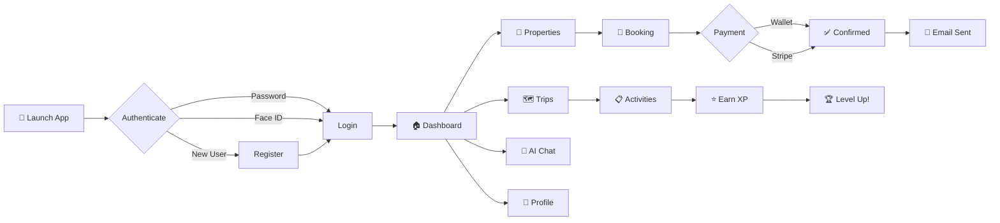
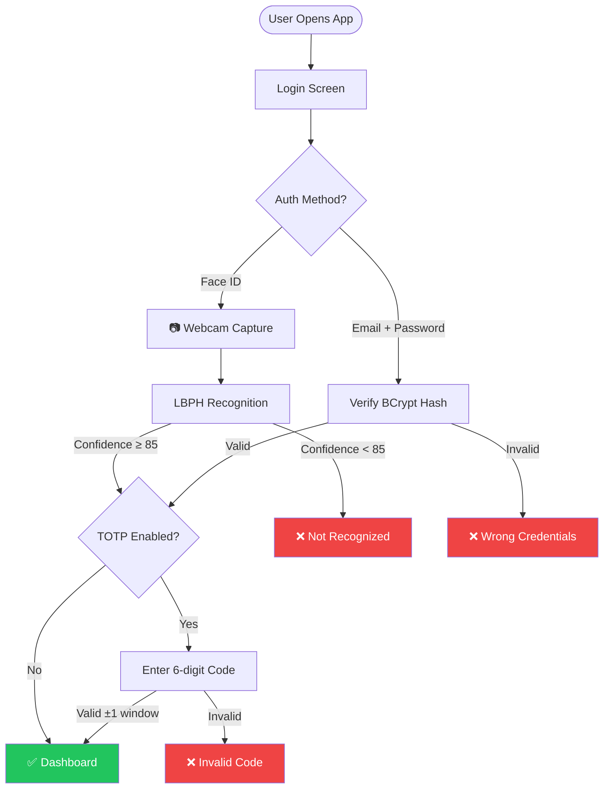
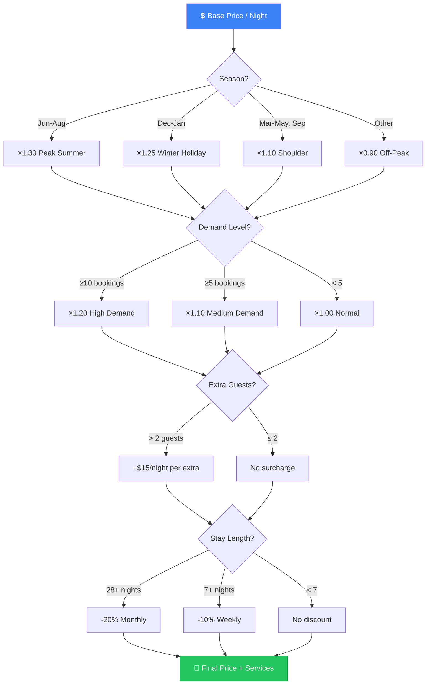
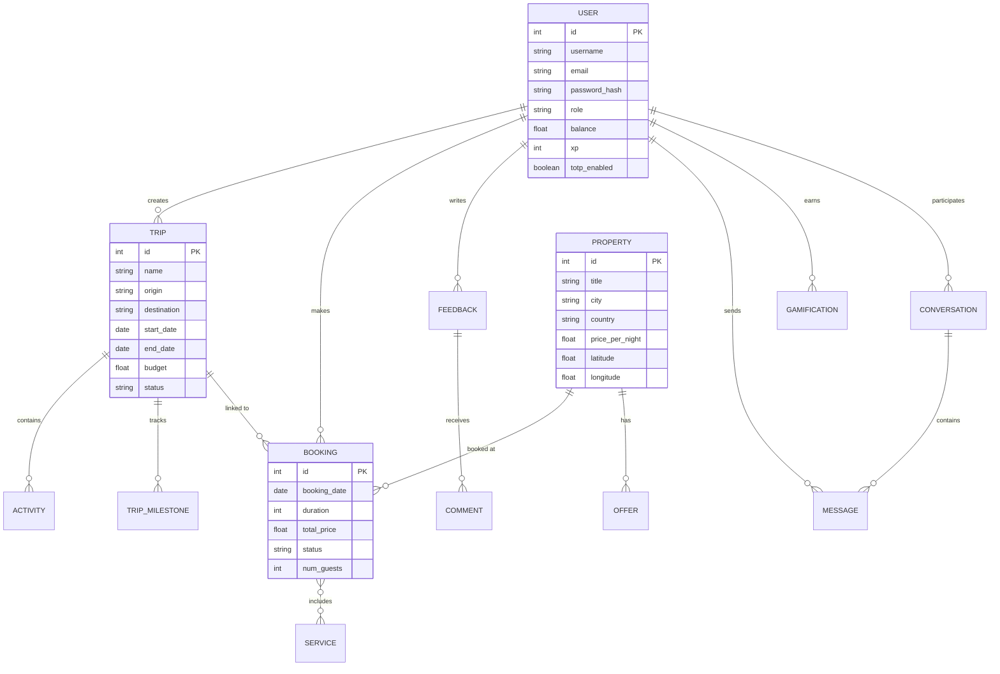
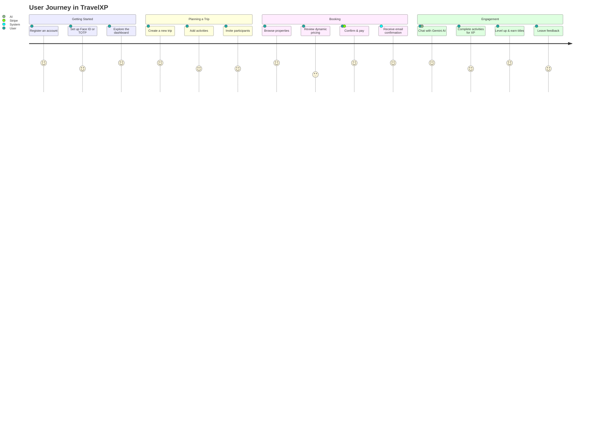
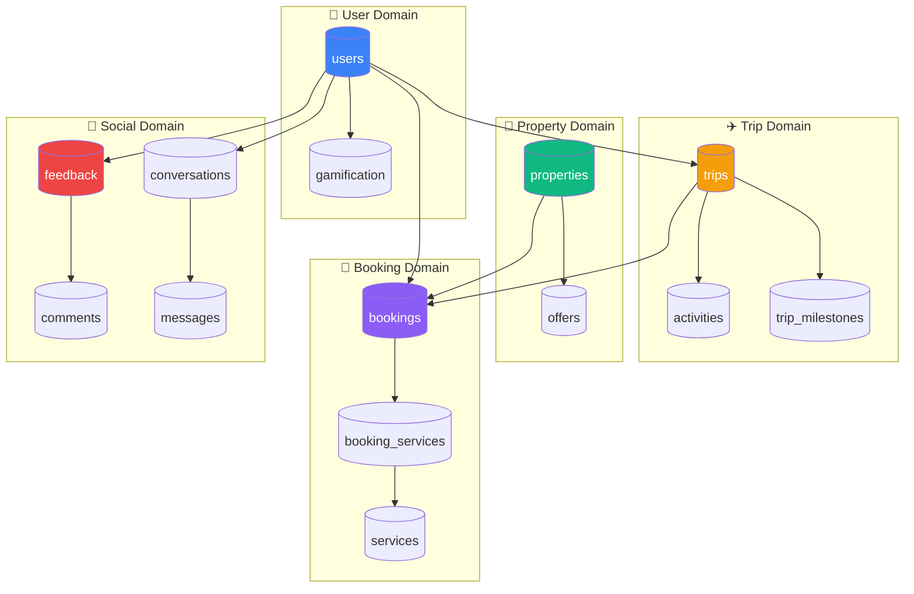

<p align="center">
  
</p>

<h1 align="center">TravelXP — Travel Like a Pro</h1>

<p align="center">
  A feature-rich JavaFX desktop travel platform for browsing properties, planning trips, booking accommodations, and engaging with a vibrant travel community — powered by AI, real-time maps, and gamification.
</p>

<p align="center">
  
  
  
  
  
  
  
  
</p>

<p align="center">
  
  
  
  
  
</p>

---

## Table of Contents

- [Overview](#overview)
- [Highlights at a Glance](#highlights-at-a-glance)
- [Features](#features)
- [Tech Stack](#tech-stack)
- [Architecture](#architecture)
- [Prerequisites](#prerequisites)
- [Installation](#installation)
- [Configuration](#configuration)
- [Usage](#usage)
- [Project Structure](#project-structure)
- [API Integrations](#api-integrations)
- [Database](#database)
- [Screenshots](#screenshots)
- [Contributors](#contributors)
- [Quick Start Cheat Sheet](#quick-start-cheat-sheet)

---

## Overview

**TravelXP** is a comprehensive desktop travel management application built with **JavaFX** and **Maven**. It provides a complete ecosystem for travelers to discover accommodations, plan multi-destination trips, manage bookings with dynamic pricing, and interact with an AI-powered assistant — all within a modern, themeable UI.

The platform supports two roles — **User** and **Admin** — each with tailored dashboards and capabilities.

---

## Highlights at a Glance

<table>
<tr>
<td align="center" width="25%">

### 🔐 3-Layer Auth
Password + Face ID + TOTP 2FA

</td>
<td align="center" width="25%">

### 🤖 AI Assistant
Gemini 2.5 Flash Chatbot

</td>
<td align="center" width="25%">

### 💰 Smart Pricing
Season · Demand · Discounts

</td>
<td align="center" width="25%">

### 🏆 Gamification
XP · Levels · 12+ Titles

</td>
</tr>
<tr>
<td align="center" width="25%">

### 🗺️ Geolocation
Geocoding + Route Planning

</td>
<td align="center" width="25%">

### 💳 Stripe Payments
Checkout + Wallet System

</td>
<td align="center" width="25%">

### 🌍 Multi-language
Auto-detect & Translate 10 langs

</td>
<td align="center" width="25%">

### 🎨 Themes
Dark / Light with smooth transitions

</td>
</tr>
</table>

---

## Features

### Authentication & Security
- **Email/Password Login** with BCrypt-hashed credentials
- **Face ID Login** — biometric authentication using OpenCV (LBPH face recognition via webcam)
- **TOTP Two-Factor Authentication** — RFC 6238 compliant, compatible with Google Authenticator and Authy (QR code setup via ZXing)
- **Password Management** — secure password change flow
- **Session Management** — persistent user sessions across views

### Trip Planning
- Full **CRUD** for trips with origin, destination, dates, budget, and status tracking (`PLANNED` → `ONGOING` → `COMPLETED` / `CANCELLED`)
- **Trip Participation** — join or leave public trips; participant tracking
- **Activity Management** — add activities (with type, date, cost, status) linked to trips
- **Trip Milestones** — track progress landmarks within a trip
- **XP Rewards** — earn experience points for completing activities

### Property & Accommodation
- Browse and manage properties with detailed listings (type, address, city, country, bedrooms, bathrooms, max guests, price/night, images)
- **Geolocation** — automatic lat/long resolution with Nominatim (OpenStreetMap) geocoding
- **Property Recommendations** — smart suggestions highlighting properties with active offers ≥ 30% discount
- **Offers System** — time-bound discount offers on properties

### Booking Engine
- Complete booking flow with date selection, guest count, and extra services
- **Dynamic Pricing Engine** with transparent breakdowns:
  - Seasonal multipliers (Peak Summer ×1.30, Winter Holiday ×1.25, Shoulder ×1.10, Off-Peak ×0.90)
  - Demand-based pricing (high demand ×1.20, medium ×1.10)
  - Extra guest surcharges ($15/night per guest beyond 2)
  - Length-of-stay discounts (weekly 10%, monthly 20%)
- **Cancellation Policy Engine** — tiered refund system (100% within 24h, 50% if > 3 days out, 0% otherwise)
- **Email Confirmations** — automated booking, cancellation, and modification emails via SMTP

### Payments & Wallet
- **Stripe Checkout** integration for secure online payments
- **In-app Wallet** — balance management with top-up (via Stripe) and automatic deductions on booking
- **Currency Exchange** — live conversion rates from ExchangeRate-API for any ISO 4217 currency pair

### AI-Powered Features
- **Gemini AI Chat Assistant** — Google Gemini 2.5 Flash-powered chatbot with full platform knowledge, multi-turn conversation support, and contextual guidance
- **Trip AI Assistant** — generates personalized trip-specific advice based on route, dates, and budget
- **Sentiment Analysis** — automatic keyword-based scoring (POSITIVE / NEGATIVE / NEUTRAL) on user feedback

### Communication
- **Real-time Messaging** — 1-to-1 conversations between users, optionally linked to feedback items
- **Unread Indicators** — per-conversation unread message counts
- **Email Notifications** — transactional emails for key booking events

### Gamification
- **XP & Leveling System** — earn XP from trips, activities, and engagement
- **12+ Titles** — progress from *Novice* → *Explorer* → *Traveler* → *Globetrotter* → *Adventurer* → … → *Beyond Limits*
- **Level Thresholds** — L1 (0 XP), L2 (50), L3 (120), L4 (200), L5 (300), then +100/level
- **Dashboard Progress Bar** — visual rank, level, and title display

### Content Moderation
- **Profanity Filter** — regex-based blacklist with automatic masking (e.g., `f***`)
- **Grammar Checking** — LanguageTool API integration for real-time spelling and grammar correction
- **Multi-language Translation** — MyMemory Translation API with auto-detection (supports French, Spanish, Italian, German, Portuguese, Russian, Japanese, Korean, Chinese, English)
- **Feedback System** — full CRUD with profanity filtering, sentiment tagging, and duplicate detection
- **Comments** — threaded comments on feedback items

### Admin Dashboard
- **User Management** — view, search, filter, sort, create, edit, role-assign, and delete users
- **Resource Management** — admin CRUD for Properties, Offers, Bookings, Trips, Activities, and Services
- **Moderation Panel** — review and manage all user-generated feedback and comments

### UI/UX
- **Dark / Light Theme Toggle** — AtlantaFX themes (PrimerDark / PrimerLight) with smooth fade transitions
- **Responsive Full-screen Layout** — adapts to screen resolution
- **Rich Dashboard** — profile card, wallet balance, gamification rank, featured properties, and featured trips

---

## Tech Stack

<table>
<tr><th>Layer</th><th>Technology</th><th>Version</th></tr>
<tr><td>☕ <b>Language</b></td><td>Java</td><td>25</td></tr>
<tr><td>🖼️ <b>UI Framework</b></td><td>JavaFX + FXML</td><td>25</td></tr>
<tr><td>🎨 <b>UI Theme</b></td><td>AtlantaFX</td><td>2.0.1</td></tr>
<tr><td>🔧 <b>Build Tool</b></td><td>Apache Maven</td><td>3.x</td></tr>
<tr><td>🗄️ <b>Database</b></td><td>MySQL</td><td>8.x</td></tr>
<tr><td>🔌 <b>DB Connector</b></td><td>MySQL Connector/J</td><td>8.3.0</td></tr>
<tr><td>🔐 <b>Authentication</b></td><td>jBCrypt, OpenCV/JavaCV, ZXing</td><td>0.4 · 1.5.10 · 3.5.3</td></tr>
<tr><td>💳 <b>Payments</b></td><td>Stripe Java SDK</td><td>24.18.0</td></tr>
<tr><td>🤖 <b>AI</b></td><td>Google Gemini 2.5 Flash</td><td>REST API</td></tr>
<tr><td>📧 <b>Email</b></td><td>JavaMail (javax.mail)</td><td>1.6.2</td></tr>
<tr><td>📋 <b>JSON</b></td><td>org.json, Gson</td><td>20231013 · 2.10.1</td></tr>
<tr><td>📄 <b>PDF</b></td><td>iTextPDF</td><td>—</td></tr>
<tr><td>📱 <b>SMS</b></td><td>Twilio</td><td>—</td></tr>
<tr><td>🌐 <b>HTTP</b></td><td>java.net.http, OkHttp</td><td>—</td></tr>
</table>

---

## Architecture

The project follows a **layered MVC architecture** with a clean separation of concerns:

```
com.travelxp
├── ai/                  # AI service layer (Gemini, Trip AI)
├── controllers/         # JavaFX FXML controllers (20 controllers)
├── models/              # Data models / POJOs (14 models)
├── repositories/        # Data access layer (8 repositories)
├── services/            # Business logic layer (24 services)
└── utils/               # Utilities (DB, profanity filter, sentiment, etc.)
```

**Design Patterns Used:**
- **Repository Pattern** — clean data access abstraction
- **Service Layer** — encapsulated business logic
- **MVC** — Model-View-Controller via JavaFX + FXML
- **Singleton** — database connection (`MyDB`), user session (`UserSession`)
- **Strategy** — dynamic pricing and cancellation policy engines

### Application Flow



### Authentication Flow



### Dynamic Pricing Engine



### Entity Relationship Overview



### Gamification Progression

```mermaid
gantt
    title XP Level Progression
    dateFormat X
    axisFormat %s XP

    section Levels
    L1 Novice           :done, 0, 50
    L2 Explorer          :done, 50, 120
    L3 Traveler          :active, 120, 200
    L4 Globetrotter      :200, 300
    L5 Adventurer        :300, 400
    L6 Voyager           :400, 500
    L7 Wanderer          :500, 600
    L8 Nomad             :600, 700
    L9 Pioneer           :700, 800
    L10 Trailblazer      :800, 900
```



---

## Prerequisites

- **Java JDK 25** (or compatible)
- **Apache Maven 3.x**
- **MySQL 8.x** server
- **Webcam** (optional — required for Face ID feature)

---

## Installation

1. **Clone the repository**
   ```bash
   git clone https://github.com/your-org/Esprit-PIDEV-3A1-2526-Travelxp.git
   cd Esprit-PIDEV-3A1-2526-Travelxp
   ```

2. **Set up the database**
   ```bash
   mysql -u root -p < travelxp.sql
   ```
   For incremental schema updates, apply the migration files in `database lifeline/` in order (see [Database](#database) section).

3. **Install dependencies**
   ```bash
   mvn clean install
   ```

4. **Configure the application** (see [Configuration](#configuration))

5. **Run the application**
   ```bash
   mvn javafx:run
   ```

---

## Configuration

Edit `src/main/resources/db.properties` to configure the application:

```properties
# Database
db.url=jdbc:mysql://localhost:3306/travelxp?useSSL=false&serverTimezone=UTC
db.user=root
db.password=

# Stripe (required for payments)
stripe.secret.key=sk_test_...

# Google Gemini AI (required for AI chat)
gemini.api.key=your_gemini_api_key

# SMTP Email (required for email notifications)
mail.smtp.host=smtp.gmail.com
mail.smtp.port=587
mail.smtp.user=your_email@gmail.com
mail.smtp.password=your_app_password
mail.from=your_email@gmail.com
```

> **Note:** For Gmail SMTP, use an [App Password](https://support.google.com/accounts/answer/185833) rather than your account password.

---

## Usage



### Step-by-Step

1. **Register** a new account or **log in** with existing credentials
2. **Set up Face ID** or **TOTP 2FA** from your profile for enhanced security
3. **Browse properties** and explore featured listings on the dashboard
4. **Plan trips** — create trips, add activities, and invite participants
5. **Book accommodations** — select dates, review dynamic pricing breakdown, and confirm
6. **Recharge wallet** via Stripe to fund bookings
7. **Chat with Gemini AI** for personalized travel guidance
8. **Earn XP** by completing trips and activities to climb the leaderboard
9. **Leave feedback** and engage with the community through comments and messaging

---

## Project Structure

```
Esprit-PIDEV-3A1-2526-Travelxp/
├── pom.xml                          # Maven project configuration
├── travelxp.sql                     # Main database schema
├── database lifeline/               # Incremental migration scripts
│   ├── setup.sql
│   ├── migration.sql
│   ├── role_migration.sql
│   ├── face_id_migration.sql
│   ├── totp_migration.sql
│   ├── booking_services_migration.sql
│   ├── dynamic_pricing_migration.sql
│   ├── feedback_migration.sql
│   ├── messaging_migration.sql
│   ├── property_geocoding_migration.sql
│   ├── trips_migration.sql
│   └── ...
├── faces/                           # Face ID training data & model
│   ├── face_model.yml
│   └── haarcascade_frontalface_default.xml
├── uploads/                         # User-uploaded images
└── src/
    └── main/
        ├── java/
        │   ├── module-info.java
        │   └── com/travelxp/
        │       ├── Main.java                  # Application entry point
        │       ├── UserSession.java           # Session management
        │       ├── ai/                        # AI services
        │       ├── controllers/               # 20 FXML controllers
        │       ├── models/                    # 14 data models
        │       ├── repositories/              # 8 data repositories
        │       ├── services/                  # 24 business services
        │       └── utils/                     # Utility classes
        └── resources/
            ├── db.properties                  # App configuration
            ├── style.css                      # Global stylesheet
            ├── com/travelxp/views/            # FXML view files
            └── icons/                         # UI icons
```

---

## API Integrations

| API | Purpose | Auth |
|-----|---------|------|
| [Google Gemini 2.5 Flash](https://ai.google.dev/) | AI chatbot assistant | API Key |
| [Stripe Checkout](https://stripe.com/docs/checkout) | Online payments & wallet recharge | Secret Key |
| [ExchangeRate-API](https://open.er-api.com/) | Live currency exchange rates | None |
| [Nominatim (OpenStreetMap)](https://nominatim.org/) | Forward & reverse geocoding | None |
| [OSRM](http://router.project-osrm.org/) | Driving routes & turn-by-turn directions | None |
| [LanguageTool](https://languagetool.org/http-api/) | Grammar & spelling checking | None |
| [MyMemory Translation](https://mymemory.translated.net/) | Multi-language text translation | None |

---

## Database

The application uses a **MySQL** database named `travelxp`. The main schema is defined in `travelxp.sql`.

Incremental migrations are stored in the `database lifeline/` directory and should be applied in chronological order for existing installations. Key tables include:

| Table | Description |
|-------|-------------|
| `users` | User accounts, roles, wallet balance, XP, TOTP & Face ID data |
| `trips` | Trip itineraries with origin, destination, dates, status |
| `activities` | Trip-linked activities with type, date, cost |
| `properties` | Accommodation listings with geolocation |
| `bookings` | Reservation records linking users, properties, and trips |
| `booking_services` | Many-to-many junction for extra booking services |
| `services` | Available add-on services |
| `offers` | Time-bound discount offers on properties |
| `feedback` | User feedback with sentiment tags |
| `comments` | Threaded comments on feedback |
| `conversations` | Messaging conversations |
| `messages` | Individual chat messages |
| `trip_milestones` | Progress milestones within trips |
| `gamification` | XP, level, and title tracking |

### Database Schema Map



---

## Screenshots

> 📸 _Add your application screenshots below. A recommended layout is provided:_

<!--
### 🔐 Login & Authentication
| Login | Face ID | TOTP Setup |
|:---:|:---:|:---:|
|  |  |  |

### 🏠 Dashboard & Navigation
| Dashboard | Dark Mode | Profile |
|:---:|:---:|:---:|
|  |  |  |

### ✈️ Core Features
| Trip Planning | Booking | AI Chat |
|:---:|:---:|:---:|
|  |  |  |

### 🛠️ Admin Panel
| User Management | Properties | Moderation |
|:---:|:---:|:---:|
|  |  |  |
-->

---

## Contributors

This project was developed as part of the **PIDEV 3A1** coursework at **[ESPRIT](https://esprit.tn/)** (2025–2026).

<table>
<tr>
<td align="center">
<a href="https://github.com/Apolake">
<br />
<sub><b>Yassine Raddadi</b></sub>
</a>
</td>
<td align="center">
<a href="https://github.com/Dhia-Raddaoui">
<br />
<sub><b>Dhia Raddaoui</b></sub>
</a>
</td>
<td align="center">
<a href="https://github.com/navTace">
<br />
<sub><b>Anas Nafti</b></sub>
</a>
</td>
<td align="center">
<a href="https://github.com/ysfltm">
<br />
<sub><b>Youssef Litaiem</b></sub>
</a>
</td>
<td align="center">
<a href="https://github.com/omarhlal49">
<br />
<sub><b>Omar Ehlal</b></sub>
</a>
</td>
</tr>
</table>

---

## Quick Start Cheat Sheet

```bash
# 1. Clone & enter
git clone https://github.com/your-org/Esprit-PIDEV-3A1-2526-Travelxp.git
cd Esprit-PIDEV-3A1-2526-Travelxp

# 2. Database
mysql -u root -p < travelxp.sql

# 3. Configure (edit db.properties with your keys)
notepad src/main/resources/db.properties

# 4. Build & Run
mvn clean javafx:run
```

---

<p align="center">
  
  
  
</p>

<p align="center">
  Built with ❤️ at <strong>ESPRIT</strong> — 2025/2026
</p>
